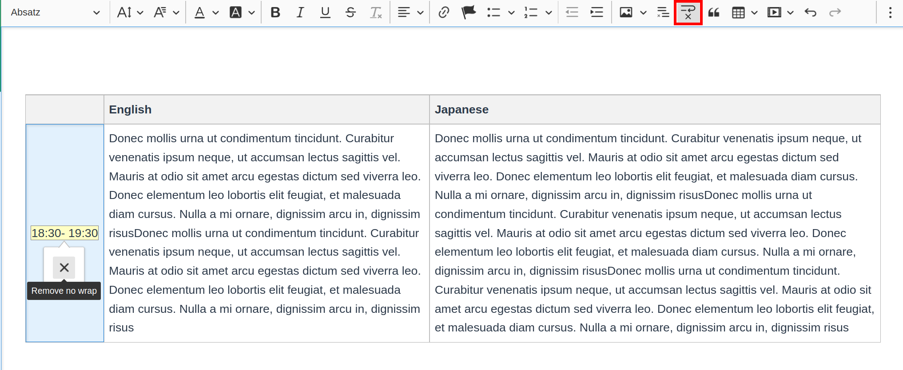

# CKEditor 5 No Wrap Plugin

Add no-wrap to text elements in CKEditor 5.

## Installation

Install `ckeditor5-no-wrap` as a dev dependency to your custom build.  
`npm i git+https://github.com/zendricom/ckeditor5-no-wrap.git#main --save-dev`

## Usage

Import the plugin and add it to your plugin list, e.g.:
`import NoWrap from "ckeditor5-clear-float/src/nowrap";`

    Editor.builtinPlugins = [
      ...
      NoWrap,
      ...
    ];

Also add the button to your toolbar, e.g.:

    Editor.defaultConfig = {
      toolbar: {
        items: [
           ...
          "noWrap",
          ...
          ],
      },
    }
